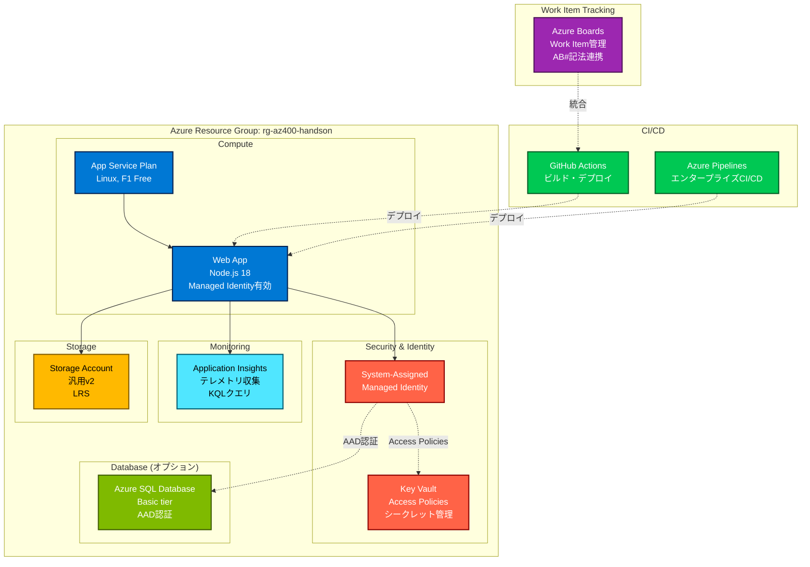

# AZ-400 3日間集中ハンズオン Bootcamp

> **最終更新**: 2026年4月28日  
> **対象試験**: AZ-400 (Microsoft Azure DevOps Solutions)  
> **シラバス**: 2026年4月24日版準拠

## 🎯 このリポジトリについて

AZ-400試験対策のための**実践的なハンズオン環境**です。模擬試験で特定された弱点領域を克服するため、3日間で以下を実装します：

- ✅ Git/GitHub高度操作（SemVer、CODEOWNERS、ブランチ戦略）
- ✅ Azure Boards統合（Work Item管理、AB#記法）
- ✅ Azure Security実践（Key Vault、Managed Identity）
- ✅ Application Insights & KQL
- ✅ CI/CD完全マスター（GitHub Actions vs Azure Pipelines）
- ✅ 実際のAzureリソースデプロイ

## 📊 学習プラン（3日間）

| Day | テーマ | 所要時間 | 主な成果物 |
|-----|--------|---------|-----------|
| **Day 1** | Git/GitHub + Azure基礎 | 4-6時間 | GitHub-Boards統合、基本インフラ |
| **Day 2** | Azure Security | 5-7時間 | Key Vault、Managed Identity、App Insights |
| **Day 3** | CI/CD完全マスター | 6-8時間 | GitHub Actions、Azure Pipelines |

詳細は [`LEARNING-PATH.md`](LEARNING-PATH.md) を参照してください。

## 🏗️ プロジェクト構造

```
az400-handson-bootcamp/
├── .github/
│   ├── copilot-instructions.md      ← Copilot最適化設定
│   ├── CODEOWNERS                   ← コードオーナー設定
│   └── workflows/                   ← GitHub Actions
├── .azure/pipelines/                ← Azure Pipelines
├── infra/bicep/                     ← インフラコード（Bicep）
│   ├── main.bicep
│   ├── modules/                     ← Key Vault、Web App等
│   └── parameters/                  ← 環境別パラメータ
├── src/webapp/                      ← サンプルWebアプリ（Node.js）
├── docs/handson/                    ← Day 1-3の詳細手順書
├── scripts/                         ← セットアップスクリプト、KQL
└── WorkItems/                       ← Azure Boards Work Item CSV
```

## 🏛️ Azure構成図

このハンズオンで構築するAzureリソースの全体像：



**主要コンポーネント**:

| リソース | 目的 | Day |
|---------|------|-----|
| **App Service Plan** | Webアプリホスティング（F1 Free tier） | Day 1 |
| **Web App** | Node.jsアプリケーション実行環境 | Day 1 |
| **Key Vault** | シークレット安全管理（Access Policies） | Day 2 |
| **Managed Identity** | パスワードレス認証 | Day 2 |
| **Application Insights** | APM・ログ分析・KQLクエリ実践 | Day 2 |
| **Storage Account** | 静的ファイル・ログ保存 | Day 1 |
| **Azure SQL Database** | （オプション）リレーショナルDB | Day 2 |
| **GitHub Actions** | CI/CDパイプライン実装 | Day 3 |
| **Azure Pipelines** | エンタープライズCI/CD比較 | Day 3 |
| **Azure Boards** | Work Item管理・GitHub統合 | Day 1 |

**セキュリティポイント（AZ-400重要）**:
- 🔒 **Key Vault**: データプレーン（Access Policies）vs 管理プレーン（IAM）の違い
- 🆔 **Managed Identity**: パスワード不要のAzure認証
- 🔐 **シークレット管理**: ハードコード禁止、GitHub Secrets使用
- 🛡️ **最小権限の原則**: RBACロール適切な割り当て

## 🚀 クイックスタート

### 前提条件

- Azure サブスクリプション
- Azure DevOps 組織
- Azure CLI (`az`)
- Git
- Node.js 18+
- VS Code（推奨）

### 1. リポジトリのクローン

```bash
git clone https://github.com/<your-org>/az400-handson-bootcamp.git
cd az400-handson-bootcamp
```

### 2. Azure環境のセットアップ

```bash
# Azure にログイン
az login --use-device-code

# サブスクリプション設定
az account set --subscription "<your-subscription-id>"

# リソースグループ作成
az group create --name rg-az400-handson --location japaneast
```

### 3. Azure DevOpsのセットアップ

#### 3.1. プロジェクト作成

1. https://dev.azure.com にアクセス
2. 「+ New project」をクリック
3. 以下を入力：
   - **Project name**: `az400-handson`
   - **Description**: `AZ-400 Handson Bootcamp - 3日間集中演習環境`
   - **Visibility**: Private
   - **Version control**: Git
   - **Work item process**: Agile
4. 「Create」をクリック

#### 3.2. Personal Access Token (PAT) の作成

Azure DevOps CLI操作に必要なPATを作成します。

1. https://dev.azure.com/{your-org}/_usersSettings/tokens にアクセス
2. 「+ New Token」をクリック
3. 以下を設定：
   - **Name**: `AZ400-CLI-Token`
   - **Organization**: 該当組織を選択
   - **Expiration**: 30日（学習期間に応じて調整）
   - **Scopes**: **Full access** または **Work Items (Read, write, & manage)**
4. 「Create」をクリックしてトークンをコピー（**このタイミングでしか表示されません！**）

#### 3.3. PATの環境変数設定（PowerShell）

```powershell
# 1. PowerShellプロファイルが存在しない場合は作成
if (!(Test-Path -Path $PROFILE)) {
    New-Item -ItemType File -Path $PROFILE -Force
}

# 2. PATをプロファイルに追記（トークンは先ほどコピーしたものに置き換え）
Add-Content -Path $PROFILE -Value "`n# Azure DevOps PAT`n`$env:AZURE_DEVOPS_EXT_PAT = `"your-pat-token-here`""

# 3. 現在のPowerShellセッションで即座に有効化（再起動不要）
$env:AZURE_DEVOPS_EXT_PAT = "your-pat-token-here"

# 4. 設定確認（最初の10文字のみ表示）
$env:AZURE_DEVOPS_EXT_PAT.Substring(0, 10) + "..."
```

**補足**:
- 次回以降、新しいPowerShellセッションを開くと自動的にPATが読み込まれます
- プロファイルの場所は通常 `C:\Users\<username>\Documents\PowerShell\Microsoft.PowerShell_profile.ps1` です
- プロファイルを確認する場合: `code $PROFILE`

**セキュリティ上の注意**:
- PATは機密情報です。Gitにコミットしないでください
- プロファイルをGit管理する場合は、別ファイル（.envなど）に分離し`.gitignore`に追加してください
- PATの有効期限が切れた場合は、Azure DevOpsで再生成し、プロファイルを更新してください

#### 3.4. Azure DevOps CLI設定

```bash
# Azure DevOps拡張機能のインストール（初回のみ）
az extension add --name azure-devops

# デフォルト設定
az devops configure --defaults organization=https://dev.azure.com/your-org project=az400-handson

# 動作確認
az devops project show --project az400-handson
```

#### 3.5. Work Itemsのインポート

用意されているCSVファイルから66個のWork Items（Epic、Feature、User Story、Task）を一括作成します。

```powershell
# スクリプトディレクトリに移動
cd scripts\setup

# Work Itemsインポートスクリプトを実行
.\import-workitems.ps1 -Organization "your-org" -Project "az400-handson"
```

**作成されるWork Items**:
- Epic: 1個（AZ-400 Handson Bootcamp）
- Feature: 3個（Day 1, 2, 3）
- User Story: 12個
- Task: 50個
- **合計: 66個**

**確認方法**:
```
https://dev.azure.com/{your-org}/az400-handson/_workitems
```

#### 3.6. 親子関係の設定

Work Itemsを作成した後、Epic → Feature → User Story → Taskの階層構造を設定します。

**方法1: スクリプトで自動設定（推奨）**

```powershell
# scripts/setupディレクトリにいることを確認
cd scripts\setup

# 親子関係を一括設定（65個のリンクを作成）
.\link-workitems.ps1 -Organization "your-org" -Project "az400-handson"
```

**実行結果の例**:
```
✓ 成功: 65 / 65

📊 設定された階層:
  Epic (1個)
  ├─ Feature (3個)
  │  ├─ User Story (12個)
  │  │  └─ Task (50個)
```

**方法2: Web UIで手動設定**

1. Azure DevOps Boards を開く
2. Backlog view でドラッグ&ドロップして階層を設定
3. または、各Work Itemを開いて「Add link」→「Add parent」で親を設定

**確認方法**:

親子関係が正しく設定されたか確認します：

```
# Epics Backlog（階層表示）
https://dev.azure.com/{your-org}/az400-handson/_backlogs/backlog/Epics

# Board View（カンバン）
https://dev.azure.com/{your-org}/az400-handson/_boards/board
```

**確認ポイント**:
- Epicを展開すると配下のFeatureが表示される
- Featureを展開すると配下のUser Storyが表示される
- User Storyを展開すると配下のTaskが表示される
- 親Work Itemの進捗は子Taskの完了率から自動計算される

**IDマッピングファイル**:
- スクリプト実行後、`WorkItems/workitem-id-mapping.csv` が作成されます
- このファイルで元のCSV IDと新しいAzure DevOps IDの対応を確認できます

### 4. Day 1の開始

詳細は [`docs/handson/day1-git-github.md`](docs/handson/day1-git-github.md) を参照してください。

## 📚 ドキュメント

| ドキュメント | 説明 |
|------------|------|
| [LEARNING-PATH.md](LEARNING-PATH.md) | 3日間の詳細学習ロードマップ |
| [docs/handson/day1-git-github.md](docs/handson/day1-git-github.md) | Day 1: Git/GitHub実践 |
| [docs/handson/day2-azure-security.md](docs/handson/day2-azure-security.md) | Day 2: Azure Security |
| [docs/handson/day3-cicd-pipelines.md](docs/handson/day3-cicd-pipelines.md) | Day 3: CI/CD |
| [docs/architecture.md](docs/architecture.md) | アーキテクチャ図 |
| [docs/exam-tips.md](docs/exam-tips.md) | 試験対策まとめ |

## 🎓 AZ-400試験対策のポイント

### 試験配分（2026年4月24日版）
- プロセスとコミュニケーション: 10-15%
- ソース管理戦略: 10-15%
- **ビルド・リリースパイプライン: 50-55%** ⭐ 最重要
- セキュリティ・コンプライアンス: 10-15%
- インストルメンテーション: 5-10%

### 頻出トピック
1. **Azure Boards と GitHub の統合**（Work Item管理）
2. **GitHub Actions と Azure Pipelines の使い分け**
3. **Key Vault IAM vs Access Policies**
4. **Managed Identity（system/user-assigned）**
5. **KQLクエリ（bin、extend、project）**
6. **ブランチ戦略の適用判断**

## 💰 コスト見積もり

| リソース | SKU | 推定コスト（3日間） |
|---------|-----|-------------------|
| App Service | B1（Basic） | ~$15 |
| Key Vault | Standard | ~$0.15 |
| Storage Account | Standard LRS | ~$0.20 |
| Application Insights | 基本 | ~$2 |
| **合計** | | **~$17-20** |

**節約Tips**: 夜間・週末はApp Serviceを停止

## 🤝 コントリビューション

このリポジトリは学習目的です。改善提案はIssueまたはPRでお願いします。

## 📝 ライセンス

MIT License

## 🔗 参考リンク

- [AZ-400 公式シラバス](https://learn.microsoft.com/certifications/exams/az-400)
- [Azure DevOps ドキュメント](https://learn.microsoft.com/azure/devops/)
- [GitHub Actions ドキュメント](https://docs.github.com/actions)
- [Bicep ドキュメント](https://learn.microsoft.com/azure/azure-resource-manager/bicep/)

---

**Good luck with your AZ-400 exam! 🚀**
